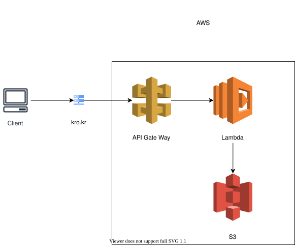

# Every2Cal

[](https://travis-ci.com/sookcha/every2cal)



Every2Cal은 Everytime 시간표를 .ics 형식으로 내보내주는 Python 프로그램입니다.

Everytime 앱 보다 캘린더로 일정을 관리하는게 편한 마음에 항상 Everytime 시간표를 수기로 캘린더에 적곤 했습니다.

그 수고로움을 덜고자 개발했습니다.

## 어떻게 사용하나요?

CLI 예시

```
python every2cal.py --source https://everytime.kr/@<식별자> --begin 20240304 --end 20240621
```

로 사용합니다.

Every2Cal은 Everytime 내부의 AJAX로 불러와지는 .xml 형식 시간표를 활용하고 있습니다.

추후에 이미지 기반 시간표 읽어오기도 지원 예정입니다.

웹 서버 실행(Flask)

```
python index.py
```
